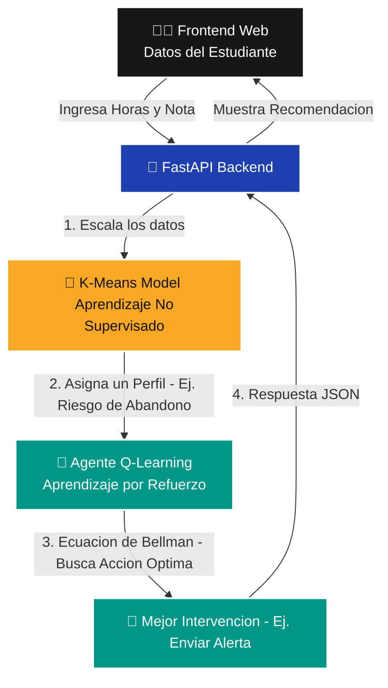

<div align="center">
  <h1>🧠 AI Smart Learning Platform</h1>
  <p><i>Plataforma adaptativa que combina Aprendizaje No Supervisado, Reinforcement Learning y una arquitectura MLOps Serverless.</i></p>
  
  [](https://www.python.org)
  [](https://github.com/astral-sh/uv)
  [](https://fastapi.tiangolo.com)
  [](https://scikit-learn.org/)
  [](https://render.com/)
</div>

---

## 📖 Sobre el Proyecto

Este proyecto es una aplicación de grado de producción (Senior Level) diseñada para revolucionar la educación personalizada. Va más allá de las predicciones clásicas, integrando un flujo completo de Inteligencia Artificial que **descubre perfiles** y **aprende a recomendar** intervenciones pedagógicas, todo sostenido por pipelines automáticos de **MLOps**.

El núcleo del sistema resuelve un problema secuencial real:
1. No tenemos a los estudiantes etiquetados previamente.
2. Necesitamos tomar decisiones que maximicen el rendimiento del estudiante a largo plazo.

Para solucionarlo, el proyecto fusiona dos paradigmas de la IA:
*   **Aprendizaje No Supervisado (Clustering con K-Means):** Para descubrir grupos ocultos de comportamiento estudiantil.
*   **Aprendizaje por Refuerzo (Q-Learning Clásico):** Un agente inteligente que aprende qué acción (video, cuestionario, descanso, alerta) es matemáticamente óptima para cada perfil.

---

## 📊 Los Datos (Dataset Real)

Se utilizó un dataset público y real para evitar escenarios sintéticos irreales:
**[Student Performance Dataset (UCI Machine Learning Repository)](https://archive.ics.uci.edu/ml/datasets/student+performance)**

*   **Origen:** Datos reales de estudiantes portugueses de secundaria.
*   **Características procesadas (Feature Engineering):**
    *   `studytime`: Horas de estudio dedicadas a la semana.
    *   `absences`: Cantidad de ausencias.
    *   `failures`: Clases reprobadas históricamente.
    *   `G3`: Nota final (Escala 0-20).

Los datos crudos son procesados mediante `StandardScaler` antes de ser inyectados al algoritmo de Clustering.

---

## 🧠 Flujo de la Inteligencia Artificial (Pipeline de Inferencia)

La magia del sistema radica en cómo colaboran los modelos en tiempo real. A diferencia de los pipelines tradicionales (`Usuario -> Modelo -> Predicción`), nuestra arquitectura utiliza un enfoque multicapa:



### 1. El Clustering (K-Means)
Extrae 4 perfiles distintos de estudiantes a partir de los datos multidimensionales. El modelo fue entrenado previamente (ver `src/ml/clustering/train_kmeans.py`) y exportado mediante `joblib` a `src/models/kmeans_model.pkl`.

### 2. El Agente (Q-Learning)
Utiliza una *Q-Table* que actúa como su memoria. Durante su entrenamiento, el agente interactuó con los perfiles simulando 5000 episodios. Aprendió, mediante recompensas positivas y negativas (retrasos, abandonos, mejoras en notas), qué intervención es mejor para cada estado. Su "cerebro" está serializado en `src/models/q_table.json`.

---

## 🏗️ Arquitectura MLOps (CI/CD)

El desarrollo del modelo no sirve de nada si no llega a producción. Este proyecto integra **MLOps End-to-End Serverless**.

```text
.
├── .github/workflows/       # Pipelines (Actions)
│   ├── ci.yml               # Integración Continua (Unit Tests para ML)
│   └── cd.yml               # Despliegue Continuo a Render
├── src/
│   ├── api/                 # Backend FastAPI y vistas Jinja2 (Frontend)
│   ├── ml/                  # Lógica de Modelos
│   │   ├── clustering/      # Inferencias y entrenamiento de K-Means
│   │   └── reinforcement/   # Entorno, Agente RL y entrenamiento
│   └── models/              # Artefactos (Q-Table, Modelos PKL, Scaler)
├── data/raw                 # Dataset original (Ignorado en git)
├── tests/                   # Pruebas Unitarias del comportamiento de la IA
├── pyproject.toml           # Dependencias manejadas ultra rápido por `uv`
└── uv.lock                  # Determinismo de entorno
```

### Escenarios Operativos Automatizados:
1. **Integración Continua (CI):** Si se modifica el código matemático en `infer_profile.py`, GitHub Actions ejecuta los *Unit Tests* (`tests/test_ml.py`). Si un cambio rompe la lógica de que un estudiante reprobado sea marcado como "Riesgo", el CI falla y bloquea el despliegue.
2. **Despliegue Continuo (CD):** Si las pruebas pasan en la rama `main`, se envía un Webhook a **Render**, el cual reconstruye el entorno (FastAPI + HTML/CSS) y expone los modelos actualizados sin tiempo de inactividad (Zero Downtime).

---

## 🚀 Inicio Rápido (Local)

Ejecutar la plataforma toma segundos gracias a `uv`.

```bash
# 1. Instalar dependencias
uv sync

# 2. (Opcional) Reentrenar modelos si modificaste parámetros
uv run python src/ml/clustering/train_kmeans.py
uv run python src/ml/reinforcement/train_agent.py

# 3. Levantar la aplicación web
uv run uvicorn src.api.main:app --reload
```
Abre `http://127.0.0.1:8000` para ver la interfaz interactiva.
